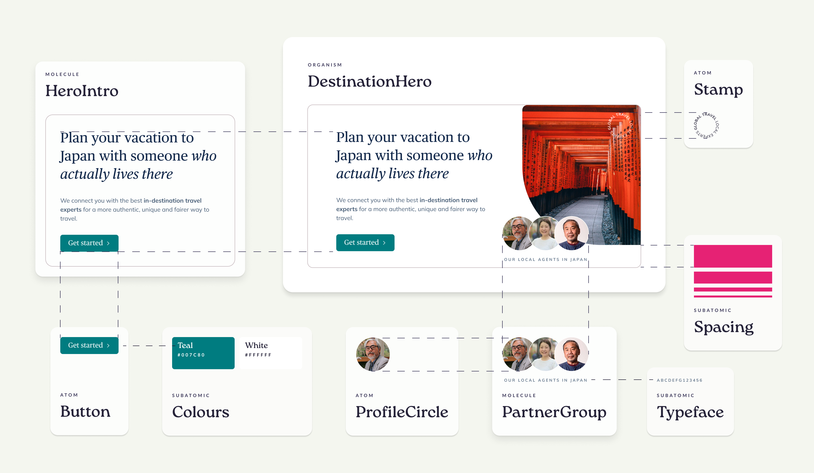
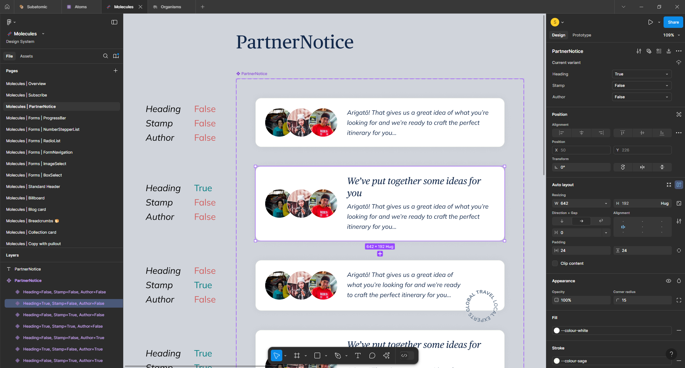
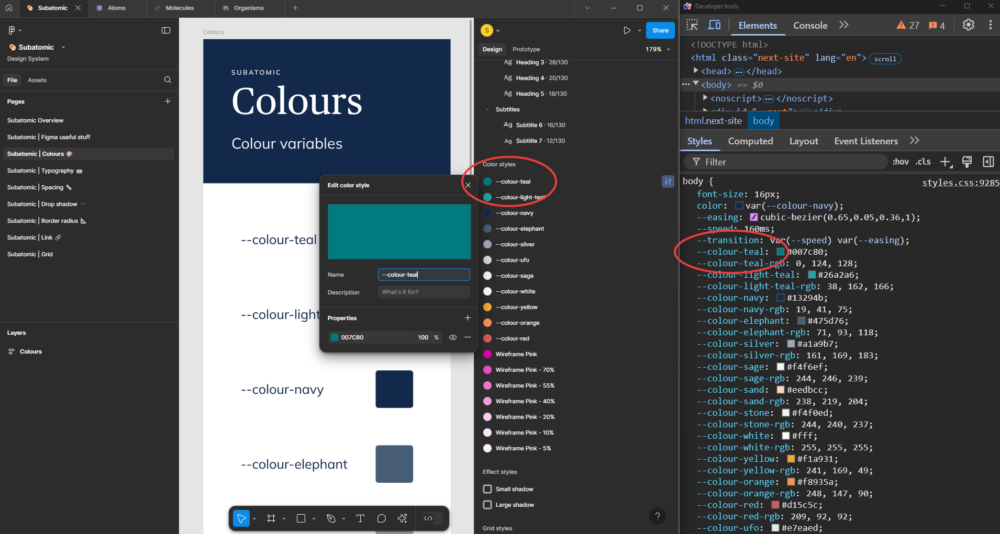
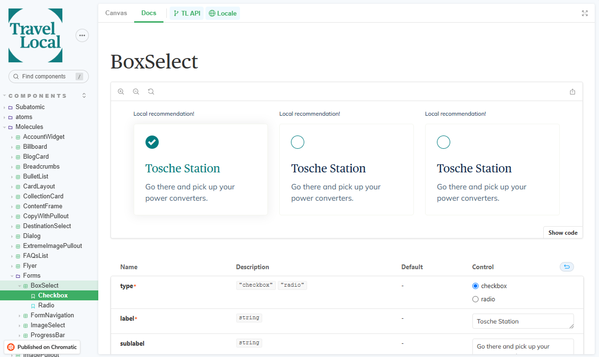

## Creating the design system and establishing atomic design principles

Little brings me more satisfaction than atomic design. It just makes sense to the technical side of my brain to modularise, standardise and reuse design elements in the same way we have been doing with code for years. All hail [Brad Frost](https://atomicdesign.bradfrost.com/) 🙌

<mark>I created the company's design system, personally designing every element and structuring it around atomic design methodology.</mark>

*The anatomy of a TravelLocal organism*

Initially I mapped out everything that was already in production, defined anything that was missing and standardised it all into reusable elements. Beginning with subatomic elements I defined tokens such as colours and spacing and worked my way up through atoms, molecules, organisms and finally templates.

Figma's component system is extremely powerful and the ability to create variants of a component as well as nest them in other components allowed me to build out complex design elements whilst retaining granular and centralised control.

*The ParterNotice component and its variants in Figma*

Creating mid-high fidelity prototypes became extremely quick, meaning we could get them in front of users early in the discovery process to learn and iterate efficiently. The system allowed production-ready designs to be reliably of high quality and helped to standardise the communication between design intent and engineering implementation.

## Close alignment with the codebase

As a designer who likes to code I've long been a supporter of blurring the line between these two disciplines. I've no love lost for those awkward Photoshop created static pngs that are 'handed-off' to engineering. Since Figma brought us variables and the ability to make components with properties that map nicely to React `props`, the potential for closer alignment with the codebase is huge - enabling a more agile, collaborative workflow between design and engineering.

<mark>I closely aligned Figma's variables and component library with the codebase's design system.</mark>

I matched the names of subatomic elements such as Figma variables with their codebase CSS equivalents, not only for colours but for font sizing, spacing, typefaces and grids. Engineers can drop into Figma, click around the component and clearly see the exact CSS variable they need to apply. Aligning naming conventions removes any ambiguity and engineers love not having to count pixels or convert units.

*Aligning Figma's naming conventions with the codebase*

I also tightly aligned Figma's component library with the React components in the codebase, ensuring naming conventions were shared and designs were in sync with their production counterparts. When defining new UI components and their variants I would make suggestions as to the properties that the corresponding React component might expect. This gave engineering a good steer on how I saw these elements interacting with the rest of the design system and further helped to communicate design intentions.

✨ _Bonus: If there's something that's easier for me to communicate in code then I'll do so, happily throwing together small Codepens to better show my intention. Figma still isn't as dynamic as just building in the browser._

## Storybook becomes the single source of truth

We set up Storybook early on in the development of the codebase and visualising our design system in this way helped give everyone a cross-team single source of truth.

*The BoxSelect molecule in Storybook*

I hooked up Storybook stories to Figma components and embedded Figma components in their Storybook stories so it was super easy to navigate between them. It feels really good when that stuff aligns so neatly!

As part of the PR workflow I accepted visual component changes via a design QA using Chromatic. This worked great as it allowed me to feedback design changes to engineers as part of their usual development workflow and ensure respective Figma components were up-to-date with any alterations that may have happened during the build.

## Maintaining and evolving as the company grows

I've steered the design system as it's grown from a 'nice to have' to be the defining way that TravelLocal designs and builds frontend experiences. Maintaining it is a task not to be underestimated but through prioritising its cohesion and formalising processes it's evolved through two rebrands and a merger and continues to mature.

Now with more than seventy-five components the design system is the backbone of how the engineering team organise frontend work and TravelLocal has seen the impact it's had on speed, quality and consistency of development and user experience.

The hardest part, as ever, continues to be coming up with good component naming conventions…