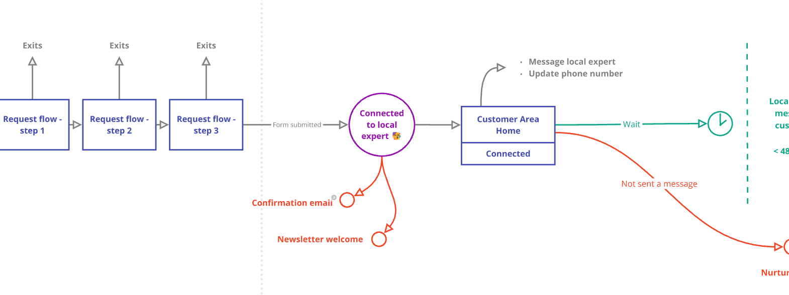
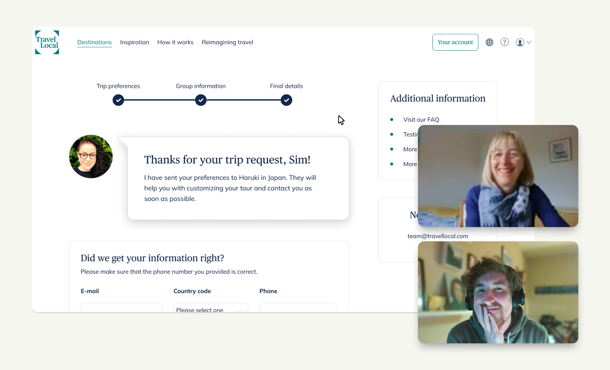
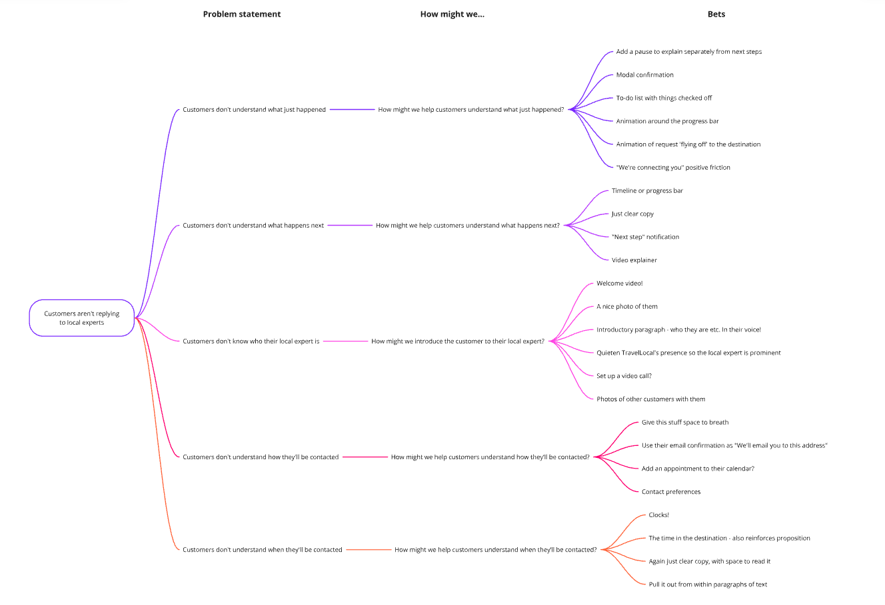
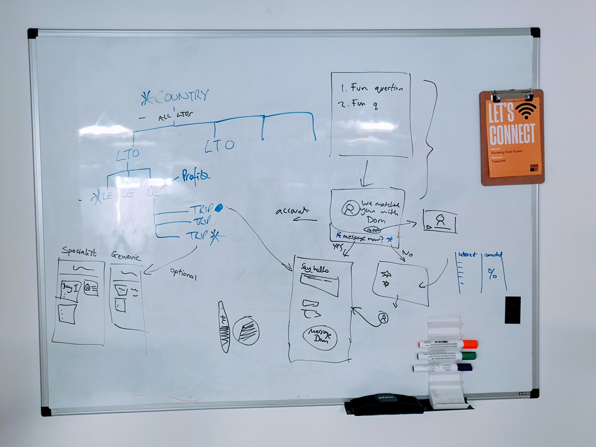
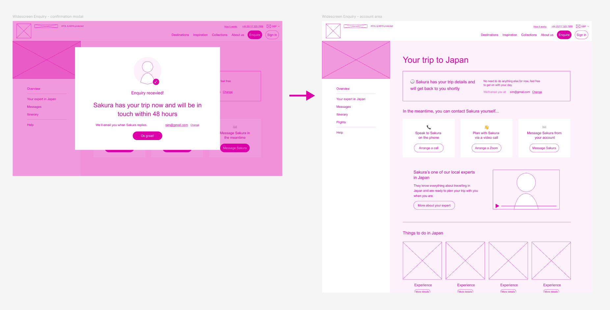
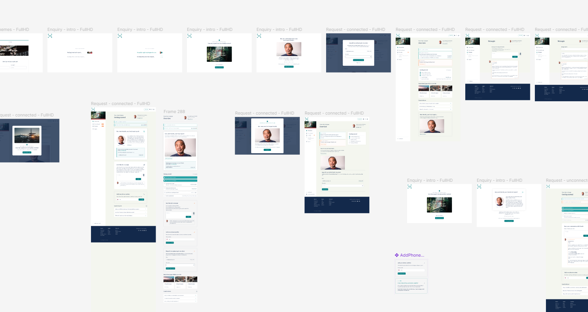
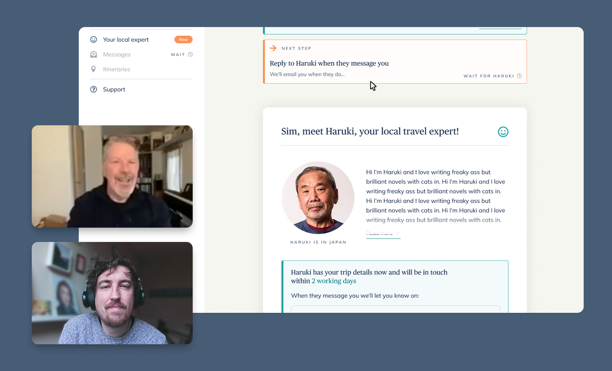
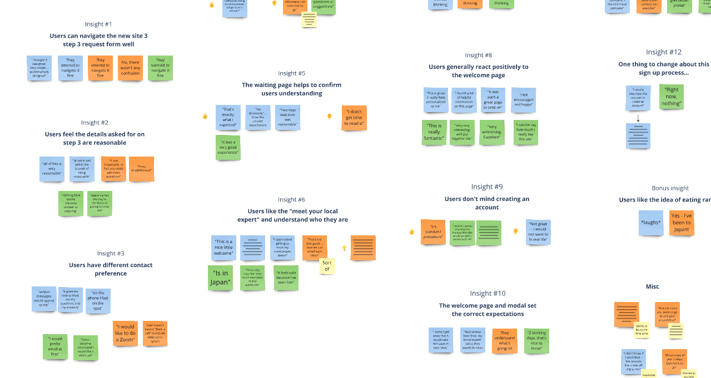
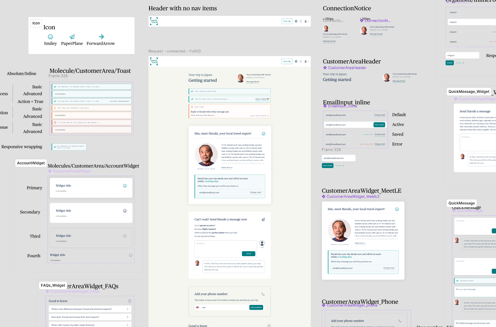
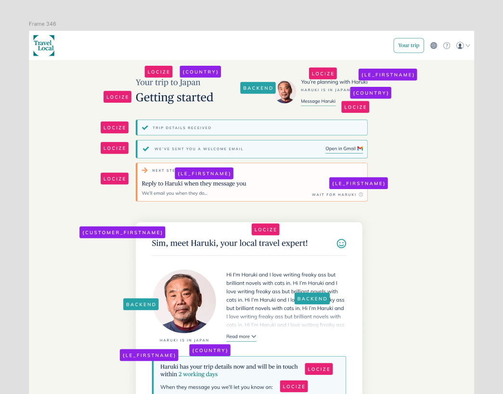

## Understanding the business challenge and defining a North Star

As TravelLocal’s acquisition model matured and more travellers were finding them, so did the amount of customers submitting their travel preferences and thus getting connected with a local expert. The expert then kicks off the conversation by messaging customers manually via the TravelLocal platform.

<mark>The first step was to understand this customer - local expert connection as the first major milestone in the high-level customer journey and therefore of key importance.</mark>

*The first major milestone in the high-level customer journey*

Working with the Head of Product we defined an important dynamic at the heart of TravelLocal’s customer experience. Because the local expert is a real person with limited time and energy, unlike traditional SasS products TravelLocal can’t onboard limitless customers if they’re inactive. Local experts would frankly waste their time and the partnerships would strain. <mark>Improving top-of-funnel acquisition rates alone would not be enough to scale the company sustainably - the customer engagement rate needed to increase.</mark>

🌟 <mark>We set our North Star objective as increasing this engagement rate.</mark>

We chose to measure engagement as the point where a customer sent three messages. Analysing request data revealed a significant increase in the propensity to book when a customer had sent three customer messages. This represented some meaningful engagement above just an exchanging of pleasantries.

We also defined two main <mark>guardrails…</mark>
1. Increase the engagement rate _without_ reducing the number of connected customers - the most sensitive of company metrics.
2. Focus our work on product design more so than service design which, although impactful, was out of scope at the time.

## Discovering why customers go quiet
<mark>My first goal was to understand why customers weren’t replying to local experts.</mark>

Initial sanity check investigations with product managers and engineers ruled out technical errors; customers were technically able to send successful messages, so no problems there.

Ideally I’d have been able to speak with inactive customers to ask why they hadn’t responded. Of course, by definition of them being unengaged that’s a dead end, so I needed to find answers higher up the funnel in the user experience leading to the moment of inactivity.

<mark>I held qualitative user research sessions with 5 participants who were new to TravelLocal.</mark> I observed them moving through the current onboarding process asking questions as we went. My goal was to better understand their motivations, feelings and uncertainties.

*Holding a user research session with a customer, going through the current flow*

Using the Atomic Research model for recording UX learnings I broke customer feedback down into its constituent parts; experiments, facts, insights and conclusions. These were recorded, tagged and organised in our research repository for future discoverability.

### Customer insights

<ul class="customer-insights">
  <li class="customer-insight">
    
😕 Uncertainty of what happened and next step

    
"Is that it? What do I do now?"

    
Customers didn’t understand what happened and what they needed to do next. They were left feeling underwhelmed and uncertain. This decreased user motivation right from the start.

  </li>
  <li class="customer-insight">
    
🕵️‍♀️ Identity of the person contacting them

    
"I presume the TravelLocal person in the photo will contact me"

    
Customers were uncertain who was going to contact them and why, leading to mistrust the process. They wrongly presumed it would be someone from TravelLocal and so missed the value proposition of the local experts. When they did get it, that was the "ah-ha" moment.

  </li>
  <li class="customer-insight">
    
📢 Method of communication

    
"How will they contact me? Will I get an email?"

    
Customers weren’t sure how they’d be contacted which added to the uncertainty of what to expect next, decreasing trust and motivation.

  </li>
  <li class="customer-insight">
    
🕑 Timing of communication

    
"When will they call? Timing is everything"

    
Customers didn’t understand when they’d be contacted and had expectations of it being quick. Some were anxious if it would be a suitable time or not.

  </li>
</ul>

I shared these insights with the wider team and company, both in write-ups, Miro boards and video clips so team members could engage with the level of detail they needed to. Showing leadership real customer reactions helped align teams internally.

## Reviewing the current experience
We’d inherited this user experience during the company’s merger a couple of years previous so I was keen to apply a critical eye using what I knew from previous customer research as well as the updated brand, market offering and product vision.

Here's the old confirmation page, as it was before my work on the project...

<iframe src="https://embed.figma.com/proto/XnQlWbxcx4PVAVtMA74uIM/simseneca.design?page-id=0%3A1&node-id=1292-1120&viewport=-1953%2C138%2C0.29&scaling=scale-down-width&content-scaling=fixed&starting-point-node-id=1292%3A1120&embed-host=share&hide-ui=1"></iframe>

There were many improvement opportunities just by applying good UX and design principles, but those aside <mark>I defined a few broad, key themes for improvement.</mark>

<ol class="customer-insights">
  <li class="customer-insight">
    
🔍 Buried progress confirmation and next steps

    
The page was at the end of a stepped form flow but visually didn’t change much to communicate its completion. The next steps were unclear, with the customer having to infer and presume them rather than them being explicit.

  </li>
  <li class="customer-insight">
    
🪧 Unclear hierarchy of information

    
It was unclear what the customer should take most notice of. All information seemed equally important with a lack of signposting.

  </li>
  <li class="customer-insight">
    
🥸 Lack of visibility of the local expert

    
The inclusion of Hayley, a TravelLocal employee, meant that it’s TravelLocal who are the most visible, not the local expert who the customer will actually be speaking with.

  </li>
  <li class="customer-insight">
    
🤷‍♀️ Uninspiring success moment

    
This should be a super high point of customer enthusiasm. Other than one exclamation mark there’s nothing to celebrate this moment and it's generally visually uninspiring. This isn't getting me excited about my trip!

  </li>
</ol>

## Hitting a local maximum
As the project progressed and internal conversations continued it became clear that there was an opportunity for bigger change. The company, its design maturity, brand and tech stack had taken huge steps forward in the years since the current experience had been built and it all needed realigning.

Whilst often a riskier approach best avoided, <mark>the team decided that strategically now was the time to make some broader changes</mark>, allowing us to establish a better foundation from which to make future improvements.

Leading product design through a company merger where we inherited legacy user experiences has often prompted the question "are we at a local maximum?" <mark>I’ve been heavily involved in balancing evolution and revolution</mark> and have helped guide that process through highlighting user insights, bringing a fresh perspective and applying the long view to the product vision.

### De-risking for launch
<mark>With a larger change it was important to de-risk the launch.</mark> We would do this in a few ways.

1. Design an MVP to iterate from
2. Validate new designs with customers
3. A/B test any rollout
4. Only change the experience after the customer had been connected, avoiding negatively impacting the most business sensitive metric of 'connections'.
5. Work fast to retain a positive impact/effort outcome

## Turning observed problems into potential solutions
<mark>Moving into the solution space meant turning customer insights into problem statements, then turning them on their head into open "how might we" questions.</mark> This revealed five design opportunities.

1. __How might we__ help customers understand what just happened…
2. __How might we__ help customers understand what happens next…
3. __How might we__ introduce the customer to their local expert…
4. __How might we__ help customers understand how they’ll be contacted…
5. __How might we__ help customers understand when they’ll be contacted…

I then created "bets" from these, with the <mark>confidence that we were solving for observed customer problems</mark>. The phrasing of a "bet" helped to hold these loosely as unproven ideas, not validated solutions. I mapped this process onto Opportunity Solution Trees in Miro to help structure and communicate the thinking.

*A high-level selection of the bets we mapped out*

## Prototyping and designing the new experience
It became clear pretty quickly that the place for us to concentrate our design efforts was in the immediate experience after a customer had submitted their trip preferences and been connected with a local expert.

<mark>Getting that initial milestone and onboarding experience right was key to setting the customer up for success.</mark>

Moving through the bets we had both confidence in and knew to be reasonably feasible, I started wireframing before moving into mid-fidelity prototypes and landing on a testable MVP.

*Early scribbles on a whiteboard*

*Wireframing in my favourite hot pink colour*

*Mid-fidelity prototyping various ideas*

✨ Here are the final designs. They're Figma embeds, go ahead and interact..

  <iframe class="desktop" src="https://embed.figma.com/proto/XnQlWbxcx4PVAVtMA74uIM/simseneca.design?page-id=0%3A1&node-id=1314-2416&viewport=-4027%2C229%2C0.38&scaling=scale-down-width&content-scaling=fixed&starting-point-node-id=1314%3A2416&embed-host=share" allowfullscreen></iframe>
  <iframe class="mobile" src="https://embed.figma.com/proto/XnQlWbxcx4PVAVtMA74uIM/simseneca.design?page-id=0%3A1&node-id=1518-1696&viewport=-3824%2C196%2C0.33&scaling=scale-down-width&content-scaling=fixed&starting-point-node-id=1518%3A1696&embed-host=share&hide-ui=1"></iframe>

A few highlights...

<ul class="design-highlights">
  <li class="design-highlight">
    
    

      
Celebratory pause and heirarchy of information

      
Separating the information out gave each phase space to breathe and be understood. First we confirm what's just happened and then, via the proposition reinforcing "Meet your local expert" button, the customer moves into the next phase of onboarding.

    

  </li>  
  <li class="design-highlight">
    
    

      
Confirmation notifications and clear next step

      
A timeline of events reasurring customers what has happened whilst clearly explaining the next step. We also have what the time is in Japan to subtly reinforce the proposition that local experts are actually there.

    

  </li>
  <li class="design-highlight">
    
    

      
Properly introducing the local expert

      
A really important addition is to properly introduce the local expert and build trust. This also makes a neat place to confirm the user's email address, reinforcing the proposition and next step.

    

  </li>
  <li class="design-highlight">
    
    

      
Message the local expert right away

      
Having been introduced to the local expert this becomes a clearer prompt to message them right away and why. The messaging UI reinforces that this is a conversation.

    

  </li>  
</ul>

## Validating the prototype with users
<mark>To increase our confidence levels I held more qualitative research sessions with users</mark>, observing them as they used the new prototype and being curious as to their feelings.

The feedback was generally really positive and I was particularly reassured that customers felt that the "how might we’s" we’d set out to solve were being addressed.

*Testing the prototyping with another customer*

*Writing up the user feedback in Miro*

Some top feedback related to our "how might we" statements...

<ul class="customer-insights">
  <li class="customer-insight">
    
...what just happened

    
"That's exactly what I expected"

    
"I feel comforted and confident. I like this travel company"

    
👍

  </li>
  <li class="customer-insight">
    
...what happens next

    
"I realise I'm going to be receiving a personal email from my travel expert"

    
"I would wait to hear back from my travel expert"
    
    
👍

  </li>
  <li class="customer-insight">
    
...introduce the local expert

    
"I appreciated getting to know my travel expert better"

    
"It feels safe because I've seen him"

    
👍

  </li>
  <li class="customer-insight">
    
...how they'll be contacted

    
"Written messages appeal to me"

    
"That's our tour guide, now we can email each other"

    
👍

  </li>
  <li class="customer-insight">
    
...when they'll be contacted

    
"2 working days, that's nice to know"

    
"I knew right away that it would take two days to hear back"

    
👍

  </li>
  <li class="customer-insight">
    
General positive vibes!

    
"I could not give better praise"

    
"I cannot say how much I really like this site"

    
"It was such a great page to land on"

    
👍👍

  </li>
</ul>

This gave us great encouragement to continue into the development phase.

### Slimming down to an MVP
In line with our de-risking strategy, I worked with product managers, engineers and content marketing to figure out an MVP that would be viable to launch initially. Our goal was to keep the build lean but still provide a quality experience for customers; enough for us to learn from.

<mark>Here we really focussed on outcome over output.</mark> As tempting as it is to build everything, it was a core value of our product team to ensure we were building the right things and celebrating the user and business impact. <mark>That meant delivering value to users early and validating our work.</mark>

We agreed to hold back on a couple of the more complex functionality additions as well as some content that would require too much effort to pull together for launch. We would come back to them in future iterations and prove their value in more contained experiments.

## Implementation with engineering
Our frontend workflow is built on [the design system](./design-system) so I modularised my Figma designs, defining any new components and states and evolving any that pre-existed.

<mark>I collaborated closely with engineering to communicate my design intentions and figure out the best way to translate this into the codebase.</mark> When it came to development myself and engineering were speaking daily and I chipped in and built a couple of components myself to help with velocity.

*Splitting the design out into its various reusable, responsive components*

Wearing a product manager hat I wrote these components up into engineering tickets, defining design intentions and acceptance criteria.

## Collaborating with content marketing
I managed the sourcing of any copy we needed from content marketing and with engineers helped define how that would be served to the page; either via our CMS, backend database or our translation management platform Locize.

<mark>Without the role in the team specifically I took on the role of Product Marketing, making sure that the UX copy aligned with and reinforced our brand proposition.</mark>

*Defining how copy and content should be managed*

## Launching and outcomes!
Although team confidence was high off the back of our user testing, our initial plan was to release the change publicly via an A/B test. Through conversations with engineering this proved to be technically challenging so we instead launched it just for a small sample of the destinations that TravelLocal offer. Whilst unideal we were able to mitigate risk by proving that the changes didn't result in a negative impact at least before shipping it to all customers.

<mark>The launch was very successful and the changes were really positively received by customers, TravelLocal’s local experts and the internal team.</mark>

Some high level outcomes were…

- ✨ We achieved a ~25% uplift in customer engagement.
- We increased the number of messages sent to local experts immediately.
- We increased the open rate of the welcome email.
- We received positive qualitative feedback from local experts who noticed a change in customer engagement.
- We set up a solid technical and product experience foundation, enabling continuous iteration in an improved local maximum.
- We brought the experience up-to-date with the newest visual language and branding.

## Learnings and wrapping up
As ever there was plenty to learn from this project. Here are a few of mine...

1. The focus was clear which allowed us to really go deep into this particular experience. I think there might have been big wins in the service design side had we had the scope to get into that more.
2. Of course this immediate onboarding isn't an isolated experience, it's part of a whole user journey. There's a lot of potential to affect the engagement rate even higher up the funnel in the landing and sign-up experiences. If we didn't have that guardrail I'd have liked to explore that further. Watch this space 👀
3. Sometimes you have to make larger jumps over smaller iterations. The company was in a phase where it needed that so I'm pleased we could really move it along. However these bigger jumps are harder to track the impact of. The new experience included loads of new GA tracking events which is great but we didn't have old data to compare it to. Next time I'd add that event tracking to the current experience early in the project so we would have more options for comparisson and learning after the change.
4. As much as I really do believe in MVP's, as an excited designer _gahh_ it's so frustrating when you can can't build all the cool ideas right away!

### A positive impact on the customer experience

This project was just one piece of an entire user journey I owned as the Product Designer at TravelLocal, but being the first major milestone it was important to get it right. There are loads of improvements TravelLocal could make and bets to place (local expert welcome videos, functionality to book a video call, a more fleshed-out customer account area), but I'm proud of this work and its positive impact on that initial onboarding customer experience.

___

Thanks for taking the time to read this if you got all the way down here. If you ever did want to travel to Japan I can absolutely recommend it, it's beautiful.