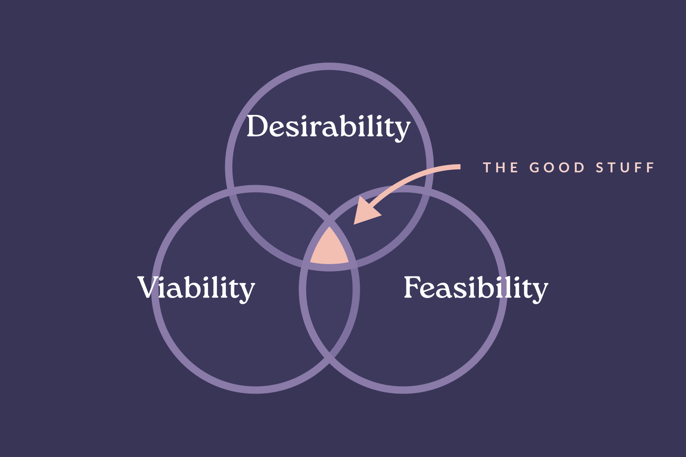

## Understanding the business challenge and defining a North Star

The core proposition of TravelLocal is that they connect you with local travel experts in the destination. If you wanted to travel to Egypt, you’d send your trip preferences (a request) and TravelLocal would connect you with a tour operator actually in Cairo. From there you would plan your trip together.

<mark>Central to this model is the conversation between local experts and customers.</mark> 

For the customer to continue to move through the booking journey those conversations need to be positive and engaging from the start.

As the company looked to scale, myself and the product team deeply understood the key business challenge. We needed to <mark>ensure that the customers we were onboarding were ready and enthusiastic about the conversational part of the proposition</mark>. If not, local experts would get in touch with customers but receive no reply. This would lead to unsustainable, wasted effort and frustration.

One method of measuring the quality of this early conversation was whether customers had sent three messages to their local expert. We identified this as a significant tipping point reflecting meaningful engagement.

✨ <mark>We set our North Star metric as improving this customer engagement.</mark>

The more customers reach this early milestone, the more eventually convert into bookings. Importantly, this further decreases the Customer Acquisition Cost (CAC).

So critical to the company's growth was this North Star that it led us across multiple pieces of work, including [successfully improving the initial onboarding experience](./onboarding-and-expectation-setting).

We set ourselves a couple of early guardrails…

1. We prepared for the potential reduction of trip requests. This would be acceptable if it were counterbalanced with an increase in engagement of the requests TravelLocal _did_ receive. <mark>To mitigate risk, we set the amount of requests we’d be comfortable seeing a reduction by.</mark>
2. We wanted to learn as fast as possible. We decided to hyper-focus on <mark>rapid iteration and lightweight MVP’s</mark> over perfectionism; embracing a 'good enough' mentality.

## Targeting the landing experience

At the time, Pay-per-click (PPC) was the focus of TravelLocal’s acquisition strategy so the majority of customers would land straight on a country page from a search like "Holidays to Egypt".

Having previously made [successful improvements to the customer experience lower in the funnel](./onboarding-and-expectation-setting), <mark>we decided to improve the landing experience right at the top of the funnel</mark>. The strategy was to boost customer enthusiasm early on, fostering positive intent that would carry through the rest of the experience.

<!-- _Diagram of the funnel, pointing to the top as our next place to focus on_ -->

<mark>As a challenger in the travel space, TravelLocal’s country page was often a customers’ first impression of the brand. Getting this right was critical for customer success and I was confident that improving it could drive high impact.</mark>

## Discovering why customers don’t engage

On this occasion I worked with customer researcher Ryan Garner to better understand what engagement challenges customers were facing. It can be extremely helpful to work with external colleagues from time-to-time. Ryan gave a fresh perspective and <mark>I had the chance to work more with the Jobs-to-be-Done framework</mark>.

After holding broad customer research sessions, Ryan proposed <mark>five observed Jobs-to-be-Done</mark>. Customers wanted to...

1. Develop a trusting relationship with a knowledgeable agent.
2. Experience an authentic connection with the local culture.
3. Feel well-looked-after with luxury service.
4. Have the logistics for their trip seamlessly managed.
5. Have the flexibility to adjust plans after booking.

<mark>These reinforced insights I'd previously gathered from speaking with customers over the years. This approach to framing the customer needs increased internal confidence and helped with wider stakeholder buy-in.</mark>

<!-- *Gleanly quotes about these 5 areas*
- *"Above average (but not luxury) trips"* -->

## Accelerating the “ah-ha” moment

I'd long understood the "ah-ha" moment to be when customers comprehend the role of the local experts. This round of research only bolstered my confidence.

Yet, <mark>that "ah-ha" moment was coming either too late or not at all</mark>. It often only happened once customers were actually contacted by the local expert. My work on the [initial onboarding experience](./onboarding-and-expectation-setting) improved this but there was more to do.

<!-- _Ah-ha moment customer emotions diagram mapped on customer journey showing where we want to move it to?_ -->

When speaking with customers I heard revealing feedback...

> "Oh I get it, they're actually there! That's great"

> "I like the fact that you have a direct link with somebody in the country you are visiting"

> "When I finally spoke to [local expert] on the video call it all made sense!"

Identifying the "ah-ha" moment sharpened our focus on optimising for that key emotional inflection point.

## Leading with the proposition

<mark>TravelLocal's proposition is strong, but was weakly communicated.</mark>

There are numerous benefits to travelling via TravelLocal but the approach challenges the established model. <mark>It introduces a new concept to customers which requires a shift in their mental models.</mark>

The current landing experience focused more on country content than the unique value of TravelLocal. <mark>The proposition was missing, and with it, any distinguishing selling points.</mark>

👇 _The old country landing page, with an emphasis on country content over unique proposition_

<iframe src="https://embed.figma.com/proto/XnQlWbxcx4PVAVtMA74uIM/simseneca.design?page-id=0%3A1&node-id=2730-2583&viewport=-2646%2C10%2C0.18&scaling=scale-down-width&content-scaling=fixed&starting-point-node-id=2730%3A2583&embed-host=share&hide-ui=1" allowfullscreen></iframe>

We knew we needed to flip this on its head. <mark>Customers needed to understand _why_ TravelLocal and _how_ it worked,</mark> especially as we knew they were often also looking at competitor sites. Once they understood the differentiators, they'd be more ready and willing to engage.

### Writing the brand proposition pillars

I'd previously established the language around the brand proposition pillars by creating a "How it works" page. Revisiting them for this landing page gave me the opportunity to evolve and deepen them.

<mark>I stepped into a Product Marketing role, translating internal brand theory into practical, customer-facing propositional copy.</mark>

I love writing product copy and believe it to be an important part of design. A beautiful visual design can be completely let down by unclear or unimaginative writing.

## Setting customer-led design directions

I pulled in some other previously learned customer behaviour insights that were helpful here. <mark>A few insights in-particular related to the customer's perception of the landing experience.</mark>

- Many customers were new to TravelLocal, with little or no prior brand exposure.
- Customers weren’t _only_ visiting TravelLocal, they were also browsing competitor sites.
- Customers were looking for bespoke, tailor-made travel, not off-the-shelf packages.
- The majority of visitors were coming to the site on mobile.

By now we'd built up a solid picture of the customer needs. <mark>Bringing all this knowledge together gave me four key design directions to take into prototyping.</mark>

1. Lead with differentiating brand proposition before delivering country content.
2. Effectively communicate the tailor-made nature of the trips.
2. Correctly set expectations of 'how it works'.
3. Focus on mobile first.

## Rapid, customer-validated iteration of the prototype

<mark>Leaning on [the design system I'd built](./design-system), I designed wireframes and mid-high fidelity prototypes for an improved landing experience.</mark>

Over the next few weeks we held three rounds of user testing, speaking with 10 customers. I iterated this prototype in-line with customer feedback, distilling insights into actionable revisions.

<mark>Working in this way meant we were able to rapidly validate and improve design choices whilst building our confidence in the success of the solution.</mark>

With all the iterations made, here are the final designs we launched with!

  <iframe class="desktop" src="https://embed.figma.com/proto/XnQlWbxcx4PVAVtMA74uIM/simseneca.design?page-id=0%3A1&node-id=2226-2213&viewport=-3824%2C196%2C0.33&scaling=scale-down-width&content-scaling=fixed&starting-point-node-id=2226%3A2213&embed-host=share" allowfullscreen></iframe>
  <iframe class="mobile" src="https://embed.figma.com/proto/XnQlWbxcx4PVAVtMA74uIM/simseneca.design?page-id=0%3A1&node-id=2227-5078&viewport=-3824%2C196%2C0.33&scaling=scale-down-width&content-scaling=fixed&starting-point-node-id=2227%3A5078&embed-host=share&hide-ui=1"></iframe>

To highlight a few of the most significant decisions and iterations...

<ul class="design-highlights">
  <li class="design-highlight">
    
    

      
Core propositional messaging

      
The page heading was purely functional and there was little mention of local experts. Instead the H1 becomes a stronger value proposition statement and the local expert photos are prominent on the page.

    

  </li>
  <li class="design-highlight">
    
    

      
Lower placement of call to actions

      
Having watched session recordings, I knew customers were clicking the "Plan your trip" button too early. Moving them lower ensured customers had the chance to understand the proposition before they continued. This breaks common SasS patterns, but was right given this particular business model.

    

  </li>  
  <li class="design-highlight">
    
    

      
Proposition before country content

      
All travel websites have generic information about a country. We're now leading with what's unique to TravelLocal, including bringing the local experts to the foreground.

    

  </li>
  <li class="design-highlight">
    
    

      
Tailor-made by design

      
The trip idea filter gave the impression that these were off-the-shelf products. These are design patterns more commonly found in ecommerce shops. By re-thinking inspirational country content as modular 'experiences' we better communicate the tailor-made aspect of the trips.

    

  </li>
</ul>

### Finding the most effective country content
### Effectively communicating who the local experts were
### The challenge of tailor-made pricing

## Delivering the minimum viable product

I'm a big fan of IDEO's 'desirability, viability, feasibility' framework. I was confident we had a desirable and viable solution. Customers responded positively to the prototype and we were solving for observed customer and businesses challenges. 

<mark>When it came to the build, our primary focus shifted to feasibility. How could we quickly and practically get this out to customers at scale?</mark>

*Desirability, viability and feasibility framework*

### Marketing feasibility

<mark>Being clear we were still in the learning phase, our aim was to get 'good enough' content together to test with.</mark> I was keen to avoid being hamstrung by future content challenges. Although important to bear in mind, we'd solve those challenges once the design impact was proven and it moved into production.

<mark>I worked closely with marketing to ensure we were able to pull together the content we required and aligned on tone of voice.</mark>

### Engineering feasibility
I held discussions with Engineering about how we could build this lightweight to learn quickly and efficiently. <mark>We decided to build static pages and hard-code copy rather than serve it from our CMS; all ways that helped us move fast.</mark>

Pairing with Engineering, we went through the design system components required and solved any uncertainties or potential challenges. <mark>I built a couple of components myself to help with velocity.</mark>

  See the Pen <a href="https://codepen.io/SimeonRowsell/pen/GgKwjga">
  TL Price Guide</a> by Simeon Rowsell (<a href="https://codepen.io/SimeonRowsell">@SimeonRowsell</a>)
  on <a href="https://codepen.io">CodePen</a>.

## Launching the A/B experiment

<mark>Obviously it was important to de-risk the launch of such a significant, top-of-funnel change. We did so by first launching a controlled A/B experiment.</mark>

With the goal of quickly reaching statistical significance we...

1. tested with the five most popular destinations
2. tested during peak weeks of the year
3. worked with performance marketing to ensure PPC campaigns were directing enough traffic

We ran the experiment through [Convert](https://www.convert.com/) with a little RegEx here and there to help with URL targeting. The Head of Product led on hooking this up with GA4 so we could properly track the results.

✨ The goal don't forget was to improve our North Star metric of customer engagement.

## Positive outcomes!

We were very happy to see that the new landing experience was a huge success.

- ✨ <mark>Customer engagement increased by 43%!</mark>
- Visits > Engagement increased by 42%
- Customer request numbers (our guardrail) only dipped slightly. This confirmed that in absolute terms the engagement increase reflected a genuine rise in activity, not just a percentage shift.
- We were able to demonstrate to those in the company who hadn't worked this way before (including executive leadership), the huge value in following a customer-first product design process. <mark>Theory turned into measurable, quantifiable business impact.</mark>

<mark>By improving the customer landing experience, TravelLocal was now better serving its customers and local experts, reducing Customer Acquisition Costs (CAC) and ultimately increasing bookings.</mark>

With such positive and provable business impact we moved the designs into production as soon as we could.

## Learnings and wrapping up

As ever there was plenty to learn from this project!

1. A key value of the Jobs-to-be-Done framework was how it helped us communicate our reasoning internally with other stakeholders. Many of the newer customer insights supported what we already knew but the framework helped us organise that and gain wider buy in.
2. In product design you always want to remain humble and open-minded. Curiosity is so often the key. But at some stage you have to follow your educated gut and try something. We'd long had the product sense that this page had the opportunity for huge impact and perhaps we could have been more confident in advocating for that focus sooner.
3. I've never been so sure as to the importance of UX copy and really enjoyed drilling deep into that to get it just right.

### A measurable, quantifiable business impact
As a customer's first experience of TravelLocal and their first step on the customer journey, having an effective landing page was critical. It was so satisfying seeing this work come to fruition and validating so many of our long-time held bets. <mark>Defining a measurable, movable metric and then discovering such an impactful solution through a customer-first approach - that's the good stuff!</mark>

---
Thanks for taking the time to read this if you got all the way down here 👋. If you did ever want to travel to Egypt, I know just the company for you - their proposition is super clear.