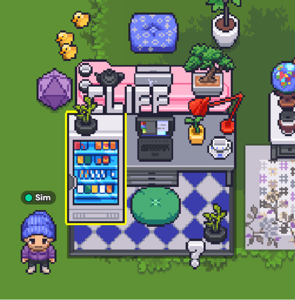

Oh hey. These are a monthly-ish, _what's floating around in my head_ kind of things. I really enjoy getting a brief digest from Dave Rupert via his ["Vibe Checks"](https://daverupert.com/tag/vibecheck/) and the various year in reviews you get around this time ([Dan Mall](https://danmall.com/posts/2024-year-in-review/), [Tony Lijić](https://www.toni.li/blog/2024_in_review])). It's nice to follow along with other people's trials and tribulations from afar and I often pick up good article, book, TV etc recommendations. There's the flicker of an Actual Real Person™, something we should hang on to as tightly as our feeble, organic, finger-claws will let us.

## <a href="#talking-of-hanging-on">#</a>Talking of hanging on
I still have this baby see, who's 10 months old now, and this past month it's felt a little bit more like hanging on in there. Just sleep and crying and utter dependence nothing major but the sense of overwhelm can be strong and January just SUCKS anyway.

The need for long-term patience seems to be a much more present part of every day than in _the before times_. It's been interesting to notice more acutely how comparitvely instant our gratification has become. If I'm asked to be patient, that means to wait like a week or two. To be really patient is to book a holiday 6 months away. The idea of being patient for something that could be an _undefined amount of years_ away, say a time when I can meaningfully introduce him to a film I love or when he can put himself to bed, is patience on a timescale I'm really not used to.

## <a href="#hang-onto-your-hats">#</a>Hang onto your hats
Having moved on from my full-time role at [TravelLocal](https://www.travellocal.com/en) in September (reasons reasons), this year sees me continue down what Paul Millerd calls [The Pathless Path](https://pathlesspath.com/). I've been on this path before and it's energising and terrifying to rejoin it, but even though the year ahead isn't clear there is now space for opportunities to arise, either proactively or reactively.

One step taken along the path this month was to launch this new personal site! It's been a long long longgg time coming and even though I have a million things I want to add and tweak it's a weight off my back to get it live. Will share more on how I built it and the things I learned soon.

Another step into the unknown is starting a digital product studio currently called _Luminous_. It's an idea I've been toying with for a while now and seems the natural progression to the experiences I've collected over the years. It's been an invigorating journey so far and the early branding is coming along nicely but like all new projects, the sands are constantly shifting as myself and collaborators discover the exact form it could take. This past month has seen some significant sand shifts, some tricky to navigate and some potentially really exciting.

Hang onto your hats and I'll share more as and when things settle!

## <a href="#hanging-at-my-new-digital-desk">#</a>Hanging at my new digital desk
I'm still leading product design at [TravelLocal](https://www.travellocal.com/en) but on a part-time consultancy basis these days. With Miro's sunsetting of [Around](https://www.around.co/) (which my team liked for its casualness), we've been trialing what is my new favourite thing, [Gather](https://www.gather.town/).

Think a cross between Stardew Valley and Pokémon Red (or Blue or Yellow if that's your thing), but instead of a farm it's your office, instead of Misty and Brock it's your colleagues and instead of training Digletts or growing corn you... do your day job.

I'll write more about Gather soon because I actually think it's a really smart and joyful solution to some of the challenges of remote working and the loss of physicality and office culture that brings, but for now check out my new desk. I've got my own vending machine.

## <a href="#absolutely-hanging">#</a>Absolutely hanging
In January I joined a gym! What a cliche. My health hasn't been so great the last couple of years. Too much sitting at a laptop, arthritis and yeh if anyone knows where my super-duper 20's metabolism went I'd love to get that back. It's refreshing to have a space to go where I have literally no other reason for being there other than getting fitter. Aiming for twice a week. So far, not bad.

## <a href="#hanging-around-in-the-kitchen">#</a>Hanging around in the kitchen
Last week we forgot to put the recycling out so this week's been a tough one for space in the kitchen. Today's the big day though so things are looking up.

## <a href="#hang-on-whats-he-done-now">#</a>"Hang on, what's he done now?!"
I'm following the news but maintaining a healthy distance. Trying to be more careful as to where I place my limited energy right now.

I did really enjoy [this article from The Guardian](https://www.theguardian.com/commentisfree/2025/jan/16/i-knew-one-day-id-have-to-watch-powerful-men-burn-the-world-down-i-just-didnt-expect-them-to-be-such-losers) though. Nailed it.

## <a href="#vibes">#</a>Vibes

🎧 ['Loving Arms (feat. Greg Blackman)' by Lack of Afro](https://lackofafro.bandcamp.com/track/loving-arms-feat-greg-blackman) - Found Lack of Afro via [Craig Charles on 6 Music](https://www.bbc.co.uk/programmes/m000h9wt) and been listening to his back catalogue this month. Positive party vibes.

🎧 ['The Disintegration Loops' by William Basinski](https://williambasinski.bandcamp.com/album/the-disintegration-loops) - These came out in 2002 so I'm behind the times here but [Matthew Syed's Sideways](https://www.bbc.co.uk/programmes/m0027ctg) introduced me. They're quite ethereal - the sounds of an old tape looping and deteriorating over an hour. The result is an affecting recording of natural decay. Beautiful, but not particularly party vibes.

🎞️ ['A Real Pain' by Jesse Eisenberg](https://letterboxd.com/film/a-real-pain/) - I generally like reflective films about male relationships against a backdrop of existential angst so this hit all the right spots. Wonderful performances, tight script, sensitively shot, subtly funny.

📺 ['Miyazaki and the Heron' by Kaku Arakawa](https://letterboxd.com/film/hayao-miyazaki-and-the-heron/) - Oh boy what an absolute joy this is. To get such a personal and honest insight into what it takes a genius like Miyazaki to create his art is a rare treat. Totally inspiring and as whimsical and profound as any of Ghibli's films.

📺 [Severence, Season 2](https://tv.apple.com/gb/show/severance/umc.cmc.1srk2goyh2q2zdxcx605w8vtx) - My thing at the moment is watching a TV series and feeling like "it would make a great two hour film." As much as I appreciate it's production design and anti-capitalist commentary this is in danger of slipping into one of them for me. I don't know what more I'm getting out of this being dragged out for hours and hours. Is the pace, dare I say, convenient for feeding Apple's capitalist machine? Juries out though, we're only three episodes in to season 2 and if it starts paying off its mystery-boxes satisfactorily enough I might feel differently.

😂 ['My Eyes Are Up Here' by Sarah Keyworth](https://www.sarahkeyworth.co.uk/) - My partner and I got a rare night out together to see some stand-up and Sarah Keyworth was terrific. If you enjoy awkward, quick-witted, self-deprecatingly "emotionally unstable non-binary" comedians then I highly recommend.

I love reading but I'm slow at it and don't get much time. You may notice these hanging around across months.

#### Currently reading
- 📖 ['Zen and the Art of Motorcycle Maintenance' by Robert Pirsig](https://uk.bookshop.org/p/books/zen-and-the-art-of-motorcycle-maintenance-40th-anniversary-edition-robert-pirsig/2223205) - It's been on the list for a while so finally getting to it. I'm only 50 pages in but can already tell it's perfectly up my street.
- 📖 ['The Book You Wish Your Parents Had Read (and Your Children Will Be Glad That You Did)' by Philippa Perry](https://uk.bookshop.org/p/books/the-book-you-wish-your-parents-had-read-and-your-children-will-be-glad-that-you-did-the-1-sunday-times-bestseller-philippa-perry/405274?ean=9780241251027) - Well I am a parent now so the glove fits. Philippa Perry is great and this is already making me think.

#### Recently finished
- 📖 ['St. Pauli: Another Football is Possible' by Carles Vinas and Natxo Parra](https://uk.bookshop.org/p/books/st-pauli-another-football-is-possible-carles-vinas/1461369?ean=9780745340906) - Modern Premier League football isn't doing as much for me these days and I'm desperately seeking the type of football that can inspire me again. Although I don't think this is _that_ well written it did give me a solid deep-dive into this community driven, unapologetically pro-minorities, anti-corporate capitalism, anti-facist football club showing that "another football is possible". Sign me up.

- 📖 ['Playing to the Gallery' by Grayson Perry](https://uk.bookshop.org/p/books/playing-to-the-gallery-helping-contemporary-art-in-its-struggle-to-be-understood-grayson-perry/665173?ean=9780141979618) - The other half of the Perry duo to have graced my bedside table recently. I love how Grayson writes about art; funny, smart and welcoming. My partner got me tickets to see him talk live later this year which I can't wait for.

Ok that's it for the innaugural Brain Soup. Well I enjoyed myself. Will tweak the format as I go. Until next time ✌️