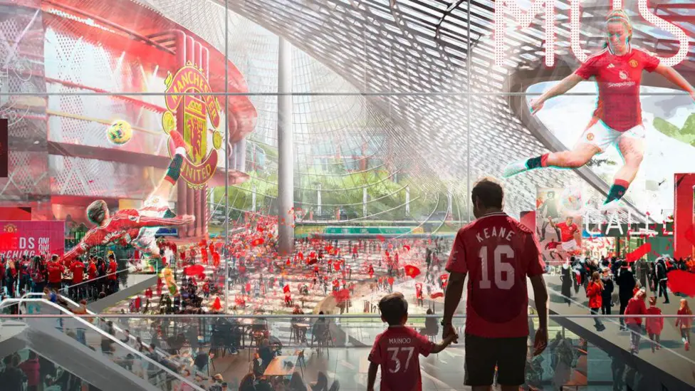
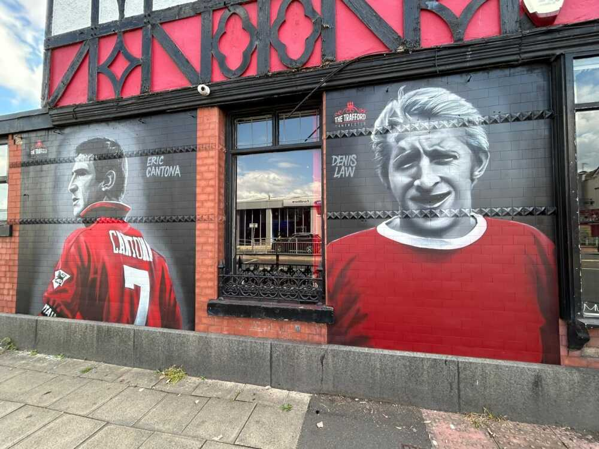
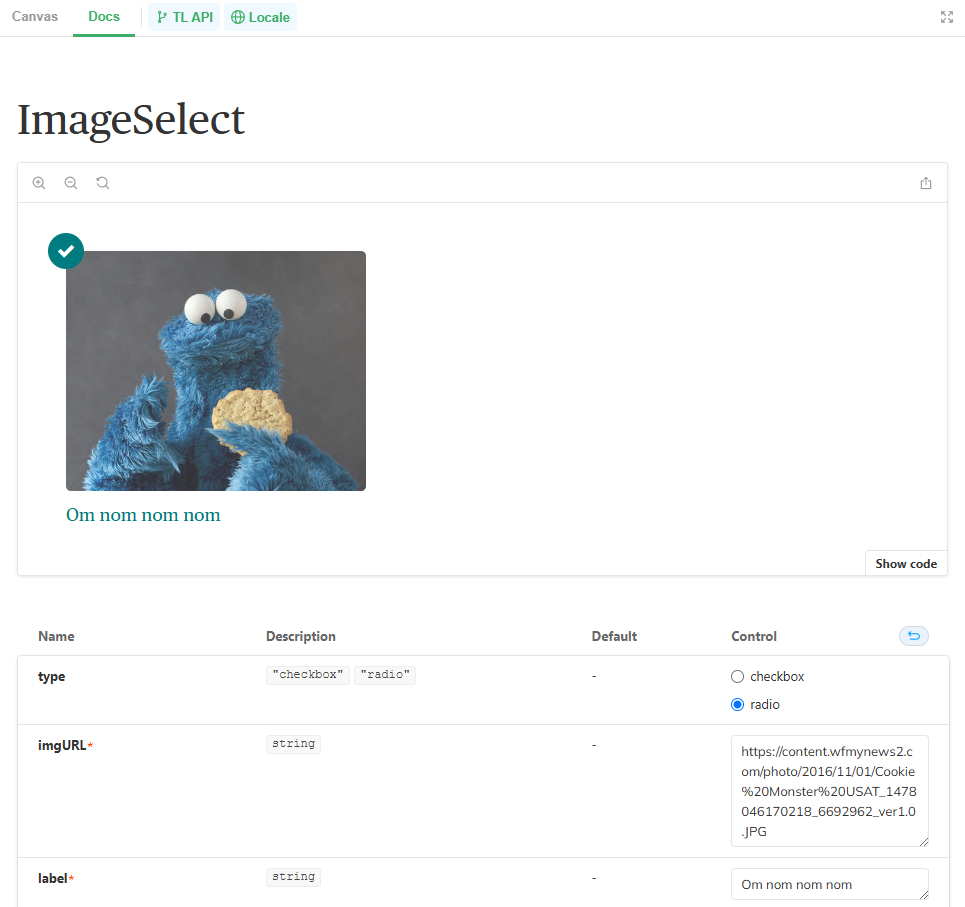
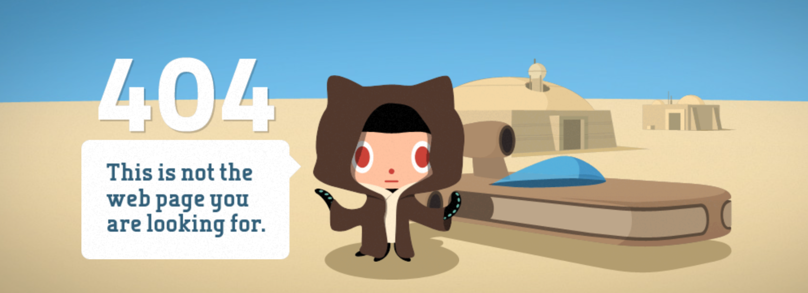

A couple of weeks ago Man United revealed their plans to build a fancy new [100,000-seater, £2b stadium](https://www.manutd.com/en/news/detail/statement-man-utd-confirms-ambition-to-build-a-new-stadium-at-old-trafford). Which is bonkers considering they're 13th in the league, [£714m in debt](https://www.insideworldfootball.com/2024/11/27/man-utd-debt-balloons-714m-cost-hiring-amorim-hits-e12-6m/) and [firing another 200 staff members](https://www.bbc.co.uk/sport/football/articles/cx28ve6ynydo). But hey, that's modern football capitalism, hooray.

As a lifelong Red (I was a child in the 90's, why *wouldn't* you fall in love with Eric Cantona), last week I headed up to Old Trafford to watch their second leg Europa tie against Real Sociedad. Only went and hammered them 4-1 didn't we! Bruunooo.

With the artist's impressions of the slick, Disneyfied, soulless shopping mall future ringing in my eyeballs, I was wistfully looking around the 115 year old stadium and all the parts of the Theatre of Dreams experience that can't be designed. The parts that have evolved organically over the years. The human artefacts that make it a real place - part of an actual community.

*© Manchester United*

Banners have gradually been added around the stands, representing specific successes, legends and fan-groups. Blocks of seating have different community vibes just by the lottery of which supporters happen to sit there. Fans have their preferred pre-match pubs with walls lovingly adorned with paintings that *just about* resemble the club legends they represent.

*© [blindtigerinns.co.uk](https://blindtigerinns.co.uk/manchester-united-legends-voted-for-by-you-painted-on-the-walls-at-the-trafford-pub/)*

Even the outdated bits feel charming to me. The font is very mid-00's, the food is terrible and there isn't enough space for modern security at the turnstiles. But it's kind of lovable.

It's a hodgepodge of choices made over the years.

My appreciation of these romantic idiosyncrasies feels incongruous with my day-to-day priorities of making very deliberate design decisions. An architect cannot choose and place those banners. The trick is instead to design a space that nurtures a natural evolution of that stuff.

A stadium iterates pretty slowly, and a full `git init` is like every hundred years. But in tech we iterate non-stop and a fresh build is comparatively frequent. We see legacy code or old choices as things to remove. 'Tech debt' isn't called 'tech cute idiosyncrasies'.

I understand the business logic in rebuilding a stadium, and sometimes the need to rebuild a whole digital product, but man wiping out that history can still suck. In a world that values efficiency and cold-hard rationality above all else, it's difficult to build an argument for these unquantifiable, "it-feels-nice", sentimental parts.

<mark>Our relentless drive for efficiency and order doesn't leave much room for the quirks and personalities of the people that made them.</mark>

But there is space and they're out there if you look for them!

## Hello Dolly
WordPress [currently powers 40% of the Internet](https://w3techs.com/technologies/details/cm-wordpress) so that's a bazillion sites or whatever and *every* install of core WP includes the wonderfully pointless [Hello Dolly plugin](https://wordpress.org/plugins/hello-dolly/).

Originally intended as a boilerplate plugin for developers it's now kinda out of date and unnecessary. [Side shout out to David Artiss who's forked an updated version!](https://github.com/dartiss/hello-dolly-redux) 

All Hello Dolly does (and ever did), is add a line to your WP dashboard from the song Hello Dolly, as popularised by Louis Armstrong. Matt Mullenweg, co-founder of WordPress, wrote it back in 2004 and loves jazz so much he now [owns a jazz bar in San Francisco](https://keysjazzbistro.com/), which is the dream.

Anyway, it's basically still there for <mark>tradition and sentimentality</mark>, and long may it remain. I'll happily continue to delete it every time I spin up a WP install. All part of the ritual.

## Fun placeholders
I'm designing components and layouts all the time and I swear it's way more fun if the placeholder text and images aren't boring old lorem ipsum. I like to use The Muppets for added cheeriness, and Star Wars references for added nerd. When they're built into Storybook, those quirks will outlive my time on the team.

*A Storybook component with placeholder Cookie Monster*

I once worked with a guy who used a Taylor Swift API to populate placeholders with a different image on every build. That actually messed with our visual diff tool Chromatic though. Every time anyone changed a file anywhere in the repo, the new Tay Tay image would need to be accepted too. Not ideal but it was part of the repo lore!

## GitHub's 404
I can't imagine GitHub's Star Wars pun 404 page was in their brand guidelines. This has the whiff of someone being given a job and just making it their own. That stuff's great. As a fellow Star Wars enthusiast I feel an immediate kinship with GitHub.

*GitHub's 404 page*

## Keep them!
Are these things inefficient, off-brand debt we should remove, or lovable quirks worth holding on to?

I'm on team Keep Them. They bring personality to a product by reflecting something real about the actual people who made them. They represent something unique in a sea of ubiquity. It's the mark of the maker; the silversmith's hallmark, Nick Park's fingerprints in the clay. People respond to authenticity. Once these artefacts are gone, they're gone for good.

That's worth remembering and perhaps even prioritising next time we advocate for building a brand new stadium.