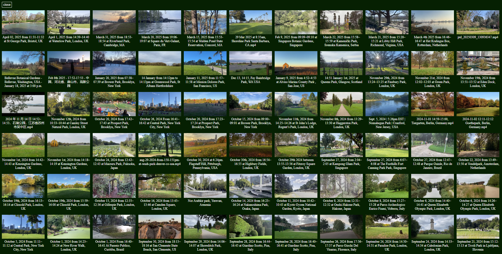
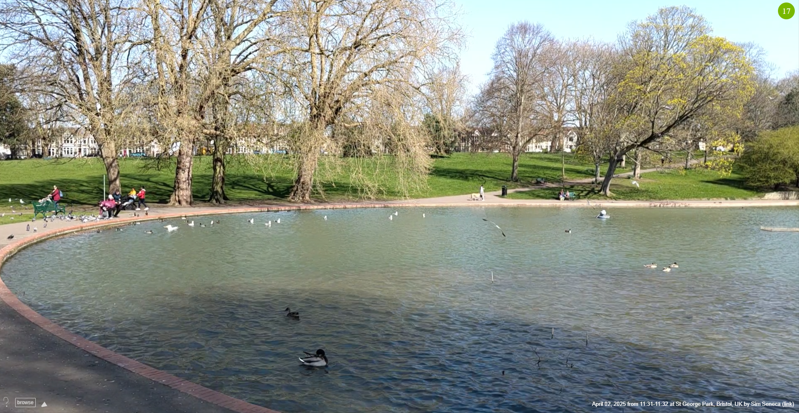
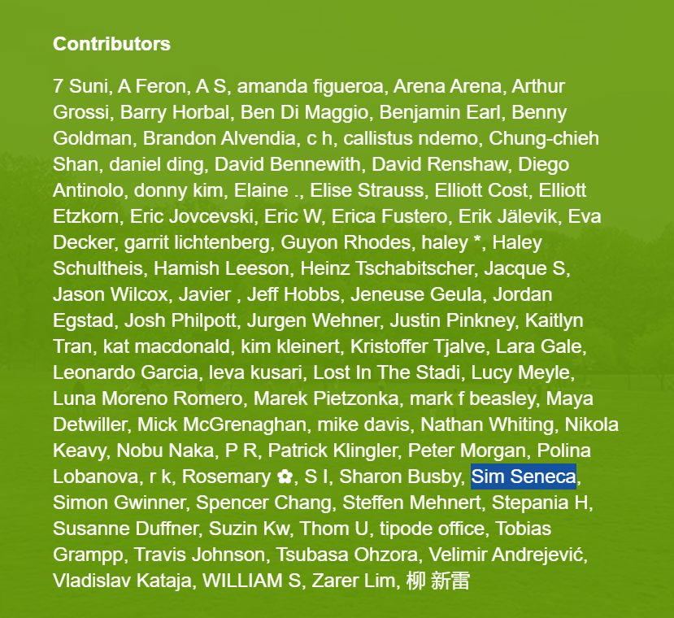

Happened upon this wonderfully wholesome project called [One Minute Park](https://oneminutepark.tv/?park=31873757). Charming, indie, old-Internet vibes.

It's a collection of minute long videos of people's local park. Windows into quiet, green, peaceful worlds. Nothing more. No social validation, no virality, no algorithms. You can just sit and patiently listen to the sounds and watch people saunter by and feel better about everything.

*Parks of the world*

There are parks in London, New York, Japan, Italy... but Bristol needed some representation, so I wandered down to my local park and recorded a [quick minute of the duck pond](https://oneminutepark.tv/?park=35706143). WHOLESOME.

The contribution process is kind of neat. Not like super fancy and slick, but refreshingly lo-fi. Film your park, hit stop when the timer reaches 60 seconds, upload it to [Are.na](https://www.are.na/elliott-cost/one-minute-park) (which seems like a cool rabbit hole I'll fall down some other time), name it according to the naming convention (such trust) and shazam it's on the site. 

*My local duck pond in the Bristol sunshine*

You even get listed as a contributor right away which feels real nice. Obviously such little moderation isn't scalable because people on the Internet suck, but in the meantime honesty is the best policy and that's delightful.

*Look Mum it's me*

This is the kind of Internet I fell in love with, and it restores my faith to see it still existing, away from the hustle and bustle in the calmer, reflective, dappled shade of the web.

Thanks to [Dense Discovery](https://www.densediscovery.com/) for sending it my way! Cheered me right up. You should [follow them](https://www.densediscovery.com/).